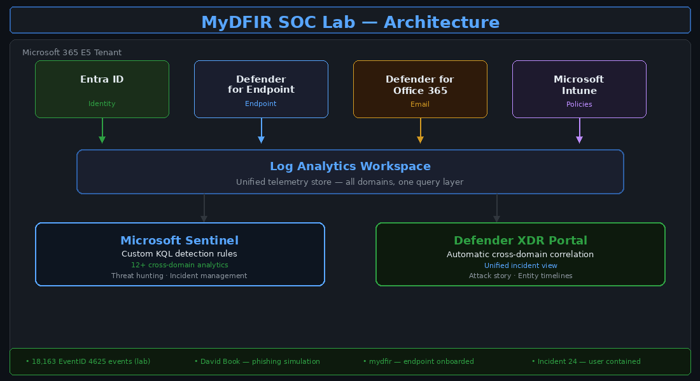
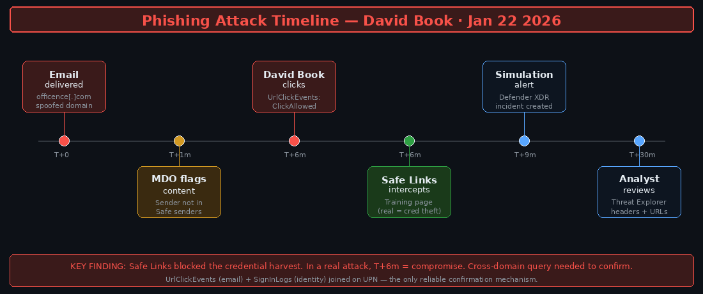

# Microsoft SOC Analyst Portfolio

### Detection, Investigation, and Incident Reporting Across the Microsoft Security Stack

*Built through 30 days of hands-on SOC simulation using real Microsoft 365 E5 tooling.*

[](https://azure.microsoft.com/products/microsoft-sentinel/)
[](https://learn.microsoft.com/microsoft-365/security/defender-endpoint/)
[](https://learn.microsoft.com/microsoft-365/security/office-365-security/)
[](https://learn.microsoft.com/entra/)
[](https://learn.microsoft.com/azure/data-explorer/kusto/query/)
[](https://attack.mitre.org/)

---

## Purpose

This repository documents a structured SOC investigation programme completed across a self-built Microsoft 365 E5 cloud lab. It is not a walkthrough of tool configuration — the emphasis throughout is on **investigation quality**: how to validate telemetry, correlate across domains, test hypotheses, and produce documentation that is actually useful to another analyst.

The work here also serves a research purpose. Each investigation uncovered a consistent pattern: the most significant threats were only visible when data from email, identity, and endpoint domains were combined. That observation is the foundation of a separate research programme on ML-based cross-domain detection — see [Related Work](#related-work) below.

---

## Lab Architecture



---

## Table of Contents

- [Environment Overview](#environment-overview)
- [Investigation Approach](#investigation-approach)
- [Mini-Project 1 — SOC Foundation](#mini-project-1--soc-foundation-and-visibility)
- [Mini-Project 2 — Email Security and Phishing](#mini-project-2--email-security-and-phishing-investigation)
- [Mini-Project 3 — Endpoint Detection](#mini-project-3--endpoint-detection-and-response)
- [Mini-Project 4 — Cross-Domain Investigation (Capstone)](#mini-project-4--cross-domain-incident-investigation)
- [KQL Query Library](#kql-query-library)
- [Key Findings](#key-findings)
- [Related Work](#related-work)

---

## Environment Overview

| Domain | Implementation |
|---|---|
| **SIEM** | Microsoft Sentinel with validated log ingestion and custom analytics rules |
| **Endpoint** | Defender for Endpoint — Windows 11 VM, onboarded and fully monitored |
| **Email** | Defender for Office 365 — Safe Links and Anti-Phishing policies configured and tested |
| **Identity** | Entra ID sign-in logs, identity risk telemetry, Conditional Access |
| **Device Management** | Intune — ASR policy deployment and enforcement validation |
| **Threat Simulation** | Atomic Red Team — MITRE ATT&CK mapped technique execution |
| **Framework** | MITRE ATT&CK throughout for technique mapping and investigation context |

---

## Investigation Approach

Every investigation in this lab followed the same five-step methodology. The point of having a consistent approach is that it catches things ad-hoc investigation misses — particularly the step of testing alternative hypotheses before concluding malicious activity.

1. **Validate the alert** — confirm timestamps, ingestion health, and affected entities before drawing any conclusions
2. **Scope the activity** — identify users, devices, the time window, and whether the activity could have spread
3. **Correlate telemetry** — pivot across email, identity, and endpoint where applicable; never stop at a single domain
4. **Test hypotheses** — consider the benign explanation before committing to the malicious one
5. **Document clearly** — produce findings, timeline, and recommendations that another analyst could act on without asking questions

---

## Mini-Project 1 — SOC Foundation and Visibility

📂 [`mini-projects/01-soc-foundation/`](mini-projects/01-soc-foundation/)

**Focus:** SIEM deployment, connector validation, and baseline KQL.


2 data connectors active, 2/2 healthy. 13 active security recommendations. No automation rules configured at this stage — I wanted to understand what I was seeing before automating any response.

**What I actually learned here:** Visibility requires deliberate configuration. The default Sentinel setup ingests data but doesn't mean it's investigation-ready. I spent more time validating that events were time-aligned and consistently structured than I expected — that groundwork matters for every query that runs afterwards.

The first meaningful signal appeared immediately: **EventID 4625 (failed logon) was generating thousands of events per day** from the test VM. That became the thread that ran through the whole lab.


```kql
// Understanding what's in the data before writing detections
SecurityEvent_CL
| summarize RandomCount = count() by EventID_s
```

EventID 4625 had 18,163 occurrences in a 24-hour window. That's simulated brute-force activity against a test VM — but those numbers are also realistic for a default-configured Windows machine exposed to the internet. The default local admin account name is the first thing automated scanners try.

---

## Mini-Project 2 — Email Security and Phishing Investigation

📂 [`mini-projects/02-email-security/`](mini-projects/02-email-security/)

**Focus:** Email threat detection, policy validation, phishing simulation, and investigation workflow.

### Policies Configured


**Safe Links settings that matter most:** Real-time URL scanning at time of click (not just delivery) and "wait for scan before delivering" — this prevents race conditions where a URL is clean at delivery but becomes malicious before the user clicks. Track user clicks is also on, which is what generates the UrlClickEvents data used in cross-domain investigation.

**Gap identified in Anti-Phishing:** Domain impersonation protection was off. This matters because the phishing email in this simulation used `officence[.]com` — a domain that impersonation rules protecting `office.com` would have caught. I flagged this as a remediation item.

### The Phishing Simulation

**Attack timeline:**



**The simulated email:**


The email arrived from `user@officence[.]com` — a lookalike for `office.com`. Outlook partially blocked content (sender not trusted) but delivered the message to the inbox. This is the real MDO default behaviour: deliver with a warning rather than quarantine outright.

**The user clicks:**


David Book clicked the link. Safe Links intercepted it and redirected to a training page. This is where a real attack diverges from the simulation: without Safe Links, the user would have landed on a credential harvesting page, and the investigation would have immediately moved to the identity domain to look for a successful sign-in from an anomalous IP.

**What the email domain alone could tell me:** a suspicious URL was clicked. Nothing more. Without correlating to the identity domain, there's no way to confirm whether credentials were stolen.

📄 [Full Phishing Investigation Report](mini-projects/02-email-security/investigation-report.md)

---

## Mini-Project 3 — Endpoint Detection and Response

📂 [`mini-projects/03-endpoint-detection/`](mini-projects/03-endpoint-detection/)

**Focus:** Endpoint telemetry, ASR rule validation, adversary simulation, alert investigation.

### VM Onboarded


`mydfir` onboarded successfully. Risk level came back as Medium — 2 active alerts, 1 incident — which was expected, because the device had already been used to generate attack simulation telemetry before the full MDE configuration was complete. I checked the device timeline first to understand what MDE had already seen.

### ASR Rules


`MyDFIR-Cyber-Policy` deployed via Intune with ASR rules configured. At the time of the screenshot, device assignment was still pending. One thing I noted here: **ASR rules should be validated through telemetry, not assumed effective**. The policy showing as created in Intune and the policy actually being enforced on the device are two different things. I confirmed enforcement by observing block events in the MDE portal after a reboot.

**Key insight from the endpoint phase:** The relationship between encoded PowerShell commands and actual malicious intent. The commands themselves (Get-LocalUser, Get-ChildItem, Compress-Archive) are not malicious in isolation — administrators run them routinely. The malicious context only becomes clear when you have the authentication context from the identity domain. That's the living-off-the-land detection problem in its simplest form.

📄 [Full Endpoint Investigation Report](mini-projects/03-endpoint-detection/investigation-report.md)

---

## Mini-Project 4 — Cross-Domain Incident Investigation

📂 [`mini-projects/04-cross-domain-investigation/`](mini-projects/04-cross-domain-investigation/)

**Focus:** End-to-end attack reconstruction across email, identity, and endpoint. This is the capstone.

### Incident 24 — Hands-on Keyboard Attack


Defender XDR correlated 58 individual alerts into a single HIGH-severity incident: ransomware behaviour, lateral movement, hands-on-keyboard attack classification. The `CONTAINED` badge on David Book's user card shows automatic attack disruption was triggered — sessions revoked, access restricted.

### The Root Cause

**MFA was disabled for David Book.**

This is not a subtle finding. It means that from the moment credentials were harvested from the phishing simulation, the attacker had uncontested access. Every subsequent stage of the attack — the risky sign-in, the PowerShell execution, the persistence attempt, the lateral movement — depended entirely on that single control being absent.

Conditional Access eventually blocked further access (error 53003):


But that happened *after* the damage was done. Conditional Access is a useful layer, but it is not a substitute for MFA — it is a complement to it.

**Why this matters for detection research:** Without cross-domain correlation, Incident 24 would have looked like three separate medium-severity alerts. A phishing click in the email domain. A risky sign-in in the identity domain. A suspicious process execution in the endpoint domain. None individually urgent. Together they are a confirmed hands-on-keyboard attack. The correlation is what makes the threat visible — and that is the specific problem my research programme aims to formalise using ML-based approaches.

📄 [Full Cross-Domain Investigation Report](mini-projects/04-cross-domain-investigation/investigation-report.md)

---

## KQL Query Library

📂 [`kql/`](kql/)

All queries used during this challenge, documented with the hypothesis each one was testing.

```kql
-- Failed logon volume triage
SecurityEvent_CL
| summarize Count = count() by EventID_s
```

```kql
-- Top targeted accounts (brute force identification)
SecurityEvent_CL
| where EventID_s == "4625"
| summarize Count = count() by Account_s
| sort by Count desc
| take 10
```

```kql
-- Cross-domain: phishing click to authentication anomaly
-- Joins UrlClickEvents (email) to SignInLogs (identity) on shared UPN
-- Full query: kql/cross-domain-phishing-to-auth.kql
```

```kql
-- Cross-domain: password spray to confirmed compromise
-- Three-stage chain: spray pattern → successful auth from spray IP → endpoint activity
-- Full query: kql/cross-domain-spray-chain.kql
```

```kql
-- Cross-domain: LOLBAS commands with authentication risk context
-- Joins DeviceProcessEvents to SignInLogs — only surfaces commands by accounts
-- with anomalous recent authentication (the precondition for LOLBAS detection)
-- Full query: kql/cross-domain-lolbas-context.kql
```

---

## Key Findings

| Finding | Evidence | What It Means |
|---|---|---|
| Single-domain detection has structural limits | Email, identity, and endpoint each saw fragments of the same attack | Correlation is not a nice-to-have — it is the mechanism that makes certain threats visible at all |
| MFA absence was the critical failure | Incident 24 progressed entirely due to disabled MFA on David Book's account | MFA is the single highest-impact identity control; everything else is layers on top |
| CA policy worked — too late | Error 53003 logged after attack progressed | Conditional Access complements MFA; it cannot substitute for it |
| LOLBAS commands are undetectable from endpoint alone | PowerShell used in Incident 24 was indistinguishable from admin activity | Authentication context from the identity domain is the precondition for detection, not an improvement on it |
| Domain impersonation gap in Anti-Phishing | `officence[.]com` would have been caught if domain impersonation was enabled | Policy coverage needs to be validated, not assumed |

### What I Would Do Differently

1. **Enable MFA before any other lab configuration.** It should be the first control in any environment, not an afterthought.
2. **Enable domain impersonation protection from day one.** The phishing simulation worked partly because this was off.
3. **Build cross-domain KQL rules before running attack simulations.** Running simulations first and then writing detection rules means the rules were never tested against unknown data — which is a weaker validation.

---

## Related Work

This lab is connected to two other repositories that build on the same environment:

**[Microsoft-SOC-Analyst-Portfolio](https://github.com/Ademolacode/Microsoft-SOC-Analyst-Portfolio)** — the cross-domain detection research work that grew out of this challenge. Includes formal KQL detection rules with documented hypotheses, paired single-domain vs. cross-domain comparisons, and full investigation reports structured for research context.

**[AI-SOC-Automation](https://github.com/Ademolacode/AI-SOC-Automation)** — Splunk SIEM integration with automated detection workflows and Atomic Red Team validation.

The pattern observed consistently in this challenge — individual signals that are individually ambiguous but collectively conclusive — is the operational motivation for a PhD research programme on ML-based behavioural threat detection in networked systems. The research proposal is available on request.

---

## Repository Structure

```text
microsoft-soc-analyst-portfolio/
├── README.md
├── screenshots/                        ← Annotated evidence + generated diagrams
│   ├── diagram-lab-architecture.png
│   ├── diagram-phishing-timeline.png
│   ├── diagram-brute-force.png
│   ├── diagram-incident24.png
│   └── [annotated screenshots 01–16]
├── kql/                                ← All queries with hypotheses
│   ├── cross-domain-phishing-to-auth.kql
│   ├── cross-domain-spray-chain.kql
│   └── cross-domain-lolbas-context.kql
└── mini-projects/
    ├── 01-soc-foundation/
    ├── 02-email-security/
    ├── 03-endpoint-detection/
    └── 04-cross-domain-investigation/
```

---

*MyDFIR 30-Day Microsoft SOC Analyst Challenge · Completed Jan–Feb 2025*  
*Ademola Oniyinde · Security Operations Analyst · demola.adeayo@gmail.com*
