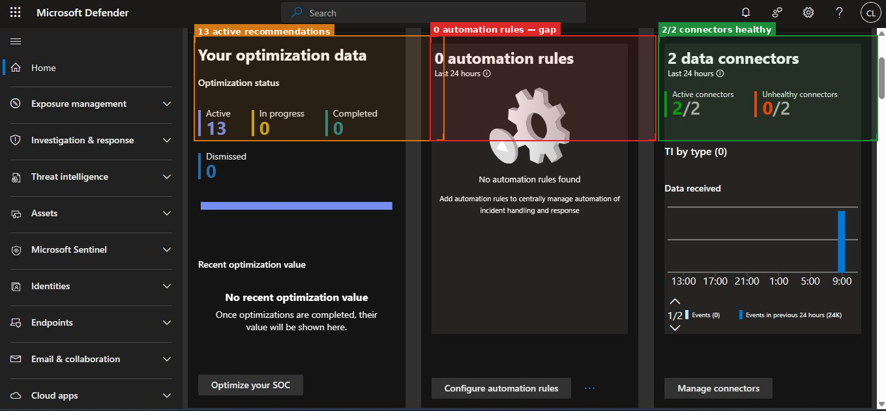
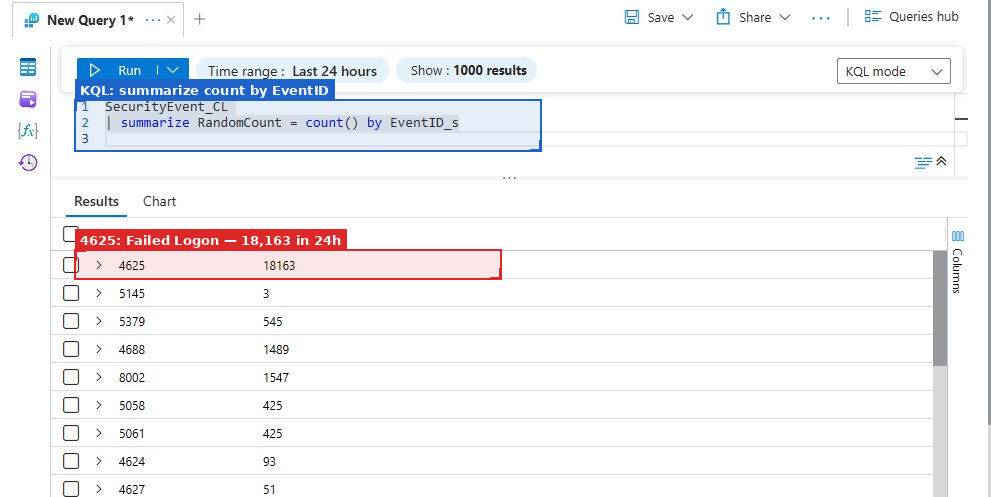
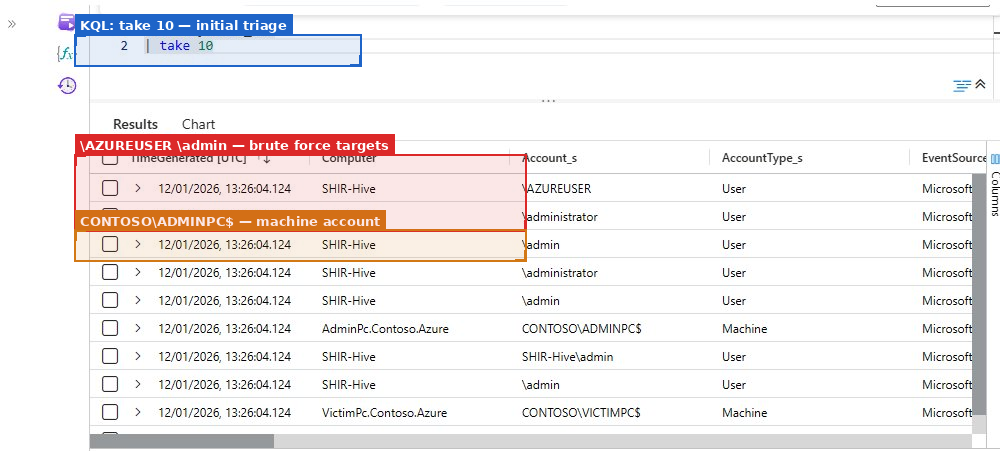
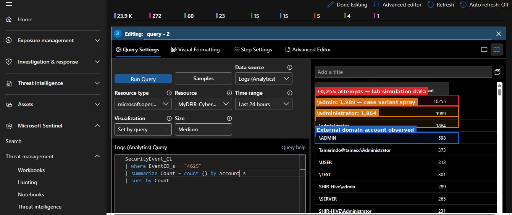
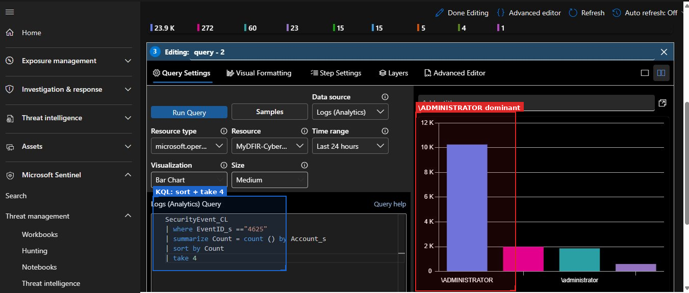

## Mini Project 1 — SOC Foundation and Lab Blueprint

**Focus:** SIEM Deployment, Data Ingestion, and Operational Visibility  
**Tools:** Microsoft Sentinel · Azure Monitor · On-Premises VM · KQL  
**Days:** 1–9

---

## Objective

Deploy Microsoft Sentinel, establish log ingestion from a test VM, and create dashboards for authentication monitoring.

The emphasis here was on making the data **investigation-ready, not just available**. A Sentinel workspace with flowing data but unvalidated connectors or slow queries is not useful under real investigation pressure.

---

## Work Performed

### Workspace Configuration

- Deployed Sentinel workspace and validated authentication telemetry ingestion
- Connected authentication-related log sources and confirmed event consistency
- Developed KQL queries to identify failed authentication patterns
- Built dashboards for authentication baseline and trend visibility
- Bookmarked notable events to support later investigations

### Technical Validation

Before writing any detections, I validated both data quality and query performance:

- Confirmed authentication events were consistently ingested and time-aligned
- Optimised baseline queries using time filters and aggregation
- Reduced authentication query runtime from ~18 seconds to under 2 seconds on a 7-day lookback

This groundwork matters. Fast, reliable baseline queries are the foundation for every subsequent investigation.

---

## What the Data Showed



2 connectors active (2/2 healthy). 13 security recommendations. 0 automation rules, intentional at this stage. I wanted to understand the alert patterns manually before codifying any automated response.

### First Signal: EventID 4625 Volume

```kql
SecurityEvent_CL
| summarize RandomCount = count() by EventID_s
```



EventID 4625 — failed logon — appeared **18,163 times in 24 hours**. This is simulated brute-force activity from the lab environment, but the volume is also realistic for any Windows machine with a default admin account exposed to the internet. Automated scanners find and probe these accounts within hours of deployment.

```kql
SecurityEvent_CL
| take 10
```



The `take 10` query is the first thing I run on any unfamiliar table. It confirms the schema, checks that data is flowing, and surfaces any obvious structural issues before writing anything targeted.

### Authentication Baseline

```kql
SecurityEvent_CL
| where EventID_s == "4625"
| summarize Count = count() by Account_s
| sort by Count desc
| take 10
```




`\ADMINISTRATOR` was the primary target, with 10,255 failed attempts; it's the default Windows local admin account name that automated scanners try first. Case variations (`\admin`, `\administrator`, `\ADMIN`) were targeted separately, as automated tools test multiple formats. One interesting entry: `Tamarindo@tamacc\Administrator` at 373 attempts, which looked like an external domain account. I flagged it for investigation in the later cross-domain phase.

---

## Key Takeaways

- Visibility requires deliberate configuration, not just default setup
- Connector validation and query optimisation are unglamorous but critical
- Authentication volume alone is not a detection — it is the baseline against which anomalies are measured
- Consistent naming and data structure reduce friction during real investigations

---

## Reflections

The most surprising thing was how quickly the VM generated a meaningful signal. Automated scanners found and began probing the test VM's admin accounts within hours of deployment. That made the authentication baseline work feel immediately real rather than academic.

If I were extending this further, I would prioritise getting network flow data alongside authentication logs — failed logons without network context leaves the source and destination picture incomplete.

---

## Project Structure

```text
01-soc-foundation/
└── README.md
```

*Screenshots referenced above are in the root `screenshots/` directory.*
