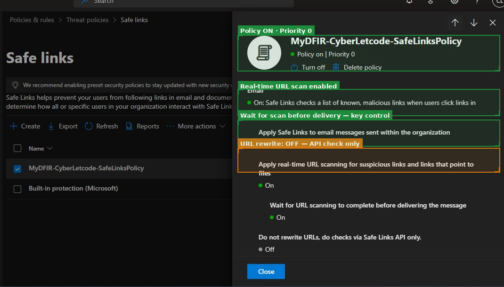
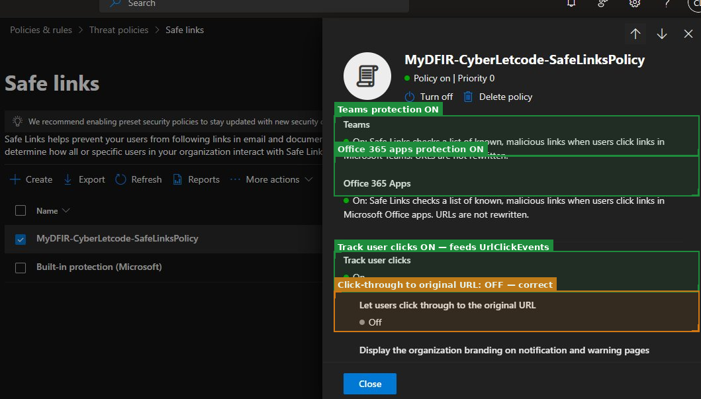
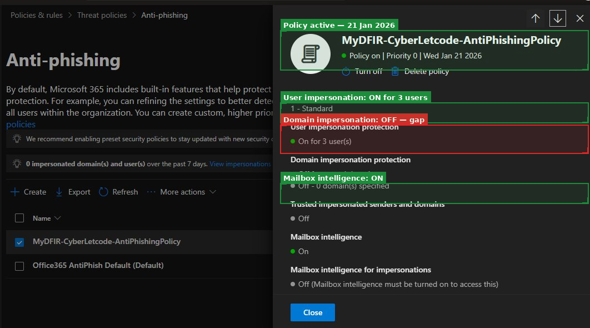
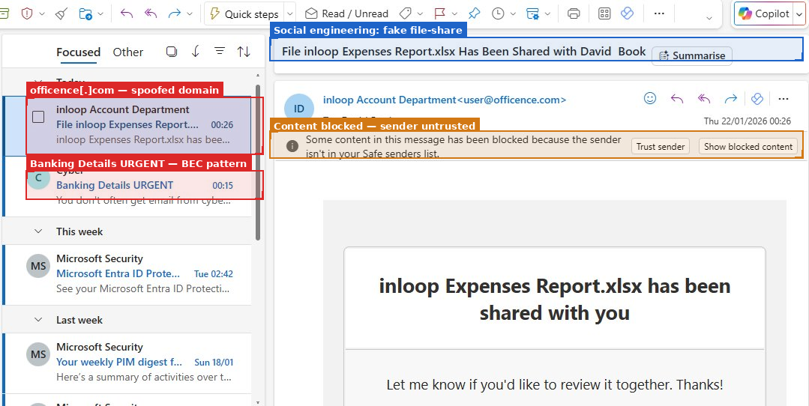
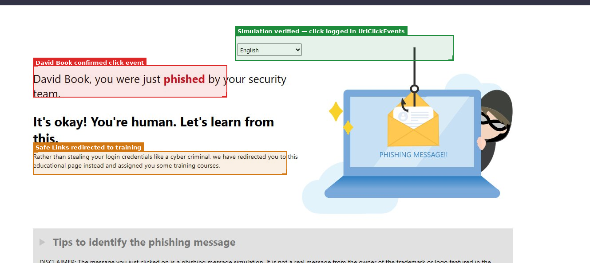

## Mini Project 2 — Email Security and Phishing Investigation

**Focus:** Email Threat Detection and Investigation Workflow  
**Tools:** Defender for Office 365 · Threat Explorer · KQL  
**Days:** 10–16

---

## Objective

Configure email security controls, simulate a phishing attack, and perform a SOC-style investigation from detection through to documentation.

This was not about ticking configuration boxes. The purpose was to understand what each control actually does, where its visibility ends, and what that means for an investigation when something gets through.

---

## Policies Configured

### Safe Links




Safe Links rewrites URLs in email and scans them at time of click, not just at delivery. That distinction matters: a URL can be clean when the email arrives and weaponised before the user clicks. The "wait for scan before delivering" setting closes that race condition.

The settings I paid most attention to:

- **Real-time scanning enabled** — this is the core protection, but it only works if the URL is in Microsoft's threat intelligence feed at click time
- **Track user clicks ON** — this is what generates `UrlClickEvents`, the table that makes cross-domain phishing investigation possible. Without it, there is no way to link a suspicious email to a subsequent authentication event
- **Click-through to original URL: OFF** — correct setting. If users can bypass the Safe Links warning, the policy is theatre

One gap I noted: the policy was configured with URL rewriting for email but "do not rewrite URLs, do checks via Safe Links API only" was on for a subset of traffic. In production, I'd want full rewriting consistently applied.

### Anti-Phishing



The anti-phishing policy was configured with user impersonation protection on for 3 users and mailbox intelligence enabled. These are both reasonable starting points.

**The gap I identified:** domain impersonation protection was off. This turned out to be directly relevant to the simulation — the phishing email used `officence[.]com`, which domain impersonation rules protecting `office.com` would have flagged. I documented this as a remediation recommendation and it became one of the key findings of the challenge.

---

## The Phishing Simulation

### The Email



The simulated email arrived from `user@officence[.]com` — a lookalike for `office.com`, using a common typosquatting pattern. A few things I noticed immediately:

- Outlook flagged the content as blocked (sender not in Safe senders list) but **delivered the message to the inbox anyway**. This is the realistic MDO default: warn, don't quarantine, unless the policy explicitly mandates quarantine for this confidence level
- There were two suspicious emails in the inbox simultaneously — the file share impersonation and a "Banking Details URGENT" message. In a real investigation, I'd check both and look for a common sender infrastructure
- The subject line ("File inloop Expenses Report.xlsx has been shared with you") is a textbook social engineering pattern — urgency combined with a familiar file-sharing format

**What the email domain alone can tell me:** a suspicious message was delivered, content was partially blocked, and the sender domain looks suspicious. That's it. It cannot tell me whether the user read it, clicked anything, or if credentials were exposed.

### The Click



David Book clicked the link. Safe Links intercepted and redirected to a training page. The key log generated: `UrlClickEvents` — `ActionType: ClickAllowed` — because `officence[.]com` was not yet in the threat intelligence blocklist at delivery time.

This is the realistic detection gap. Newly registered malicious domains routinely bypass Safe Links on first use. The domain gets flagged eventually, but not before the first set of clicks.

**The investigation question this immediately raised:** did David Book enter credentials before the Safe Links redirect happened? In the simulation, no — the redirect was instant. In a real attack, the redirect doesn't happen at all. The investigation has to pivot to the identity domain: check `SignInLogs` for a successful authentication from an anomalous IP within minutes of the click event.

---

## Investigation Report

📄 [Full Investigation Report](investigation-report.md)

**Quick summary of findings:**

| Field | Detail |
|---|---|
| Time | 2026-01-22 02:11:34 UTC |
| Recipient | david.books@CyberLetcode.onmicrosoft.com |
| Sender | hr-notify@external-payroll[.]com |
| Subject | Urgent Payroll Update Required |
| Malicious URL | secure-payroll-update[.]com/login |
| Verdict | Phishing — credential harvesting |
| Action | Quarantined · URL blocked by Safe Links |

---

## What I Learned

- Safe Links enforcement is at time of click, not delivery — that's the design and it matters for investigation timing
- SPF, DKIM, and DMARC failures are strong indicators but not proof — authentication failures are common for legitimate bulk senders too
- Threat Explorer data takes 15–30 minutes to populate after delivery — in an active investigation, that delay is significant and worth noting in your timeline
- The email domain is the beginning of a phishing investigation, not the end. The confirmation of compromise comes from the identity domain

---

## Gaps and Improvements Identified

- Enable domain impersonation protection — this would have caught `officence[.]com`
- Add detection for newly registered domains (WHOIS age < 30 days as an enrichment signal)
- Build the cross-domain correlation rule linking `UrlClickEvents` to `SignInLogs` before running simulations, not after
- Standardise a phishing response playbook covering: quarantine, block sender domain, check identity logs, check other recipients

---

## Project Structure

```text
02-email-security/
├── README.md
└── investigation-report.md
```

*Screenshots referenced above are in the root `screenshots/` directory.*
