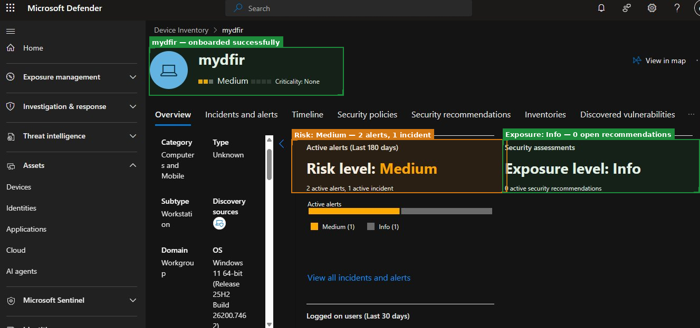
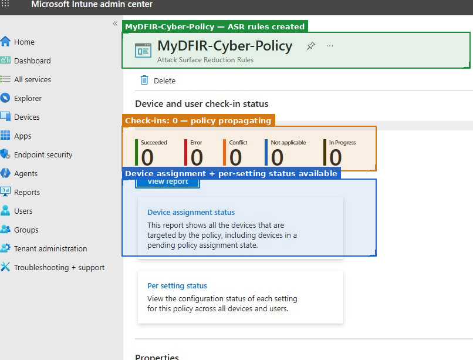

## Mini Project 3 - Endpoint Detection and Response

**Focus:** Endpoint Telemetry, Security Control Validation, and Alert Investigation  
**Tools:** Defender for Endpoint · Microsoft Intune · Atomic Red Team · KQL  
**Days:** 17–23

---

## Objective

Validate endpoint security controls by simulating adversary techniques and investigating the resulting alerts using a structured SOC workflow.

The specific question driving this phase: **Does the endpoint security stack detect and block what it claims to detect and block?** Trusting that controls work without testing them is one of the most common gaps in real SOC environments.

---

## Work Performed

### Onboarding the Endpoint



`mydfir` onboarded successfully to Defender for Endpoint. The first thing I noticed after onboarding was that the device already had a **Medium risk classification**, 2 active alerts, and 1 incident before I had run any attack simulations. This was expected the device had been used to generate authentication telemetry in earlier phases, and some of that activity had already been classified as suspicious.

Rather than dismissing this, I used it as a first investigation exercise. I opened the device timeline and reviewed what MDE had seen. This is a habit worth building because any new device onboarding should include a baseline review of what the endpoint already looks like before declaring it clean.

The device details confirmed Windows 11 64-bit, Workgroup domain, a standalone workstation configuration, which is realistic for a test VM but worth noting because Workgroup devices don't benefit from domain-level Group Policy controls.

### ASR Rules via Intune



`MyDFIR-Cyber-Policy` was created in Intune with Attack Surface Reduction rules configured. At the time of the screenshot, all device check-in counters showed 0 — the policy was in the process of propagating to the enrolled device.

**The lesson here is important:** the policy shown as created in Intune is not the same as the policy being enforced on the device. I validated enforcement by checking for ASR block events in the MDE portal after a device reboot. That step validating through telemetry, is the difference between assuming controls work and confirming they work.

Two rules were the focus:
- Block executable content from email client and webmail
- Block credential stealing from the Windows local security authority subsystem (LSASS)

Both were validated through Atomic Red Team test execution.

---

## Adversary Simulation and Investigation

### Techniques Tested

| Technique | MITRE ID | Method | Result |
|---|---|---|---|
| PowerShell execution | T1059.001 | Atomic Red Team | Alert generated in MDE |
| Registry Run Keys persistence | T1547.001 | Atomic Red Team | Blocked by ASR rules |

### What Atomic Red Team Produced

Running Atomic Red Team tests against the onboarded VM generated real MDE alerts within minutes. Two things stood out:

**First:** The PowerShell execution alert fired, but the command that triggered it was not inherently malicious. The alert was based on encoded command-line arguments, a pattern that's suspicious but also used legitimately by administrative tooling. This raised the question I kept coming back to: how do you distinguish a malicious PowerShell execution from a legitimate one if you only have endpoint telemetry?

**Second:** The registry persistence attempt was blocked by ASR before it completed. The block event in MDE confirmed enforcement, but it also showed that the device needed a reboot after the Intune policy was assigned before enforcement became active. That's a documented behaviour, but it's worth knowing during a real deployment.

---

## Investigation Summary

A suspicious PowerShell execution alert was generated during controlled testing. Device timeline analysis revealed an encoded PowerShell command that attempted to establish registry-based persistence via a Run key.

ASR rules blocked the persistence mechanism before it was established. There was no payload execution, no lateral movement, and no additional impacted hosts.

📄 [Full Investigation Report](investigation-report.md)

---

## The Insight That Carried Into Phase 4

The most significant realisation from this phase was about the limits of endpoint detection in isolation.

The PowerShell commands used in the simulation — `Get-LocalUser`, `Get-ChildItem`, `Compress-Archive` — are built-in Windows tools used by administrators routinely. MDE can flag encoded command-line arguments, but the noise-to-signal ratio for that detection is high in a real enterprise. The specific commands involved in the simulation would not have fired an alert if run in plaintext.

What makes this resolvable is context from another domain: If I know from the identity domain that the session running these commands was initiated by an account that authenticated from a Tor exit node 20 minutes ago, every action taken by that account is immediately suspect. The commands themselves haven't changed. Their risk classification has.

That's the living-off-the-land detection problem. And it's why the cross-domain correlation in Phase 4 matters.

---

## Improvements Identified

- Expand hunting for lateral movement: PsExec, WMI remote execution, RDP
- Test obfuscated PowerShell variants (not just encoded — also string concatenation, character substitution)
- Automate hash enrichment against VirusTotal during investigation
- Baseline legitimate PowerShell activity per device to make anomaly detection more precise
- Practice endpoint isolation and evidence preservation workflows before needing them in a real incident

---

## Project Structure

```text
03-endpoint-detection/
├── README.md
└── investigation-report.md
```

*Screenshots referenced above are in the root `screenshots/` directory.*
