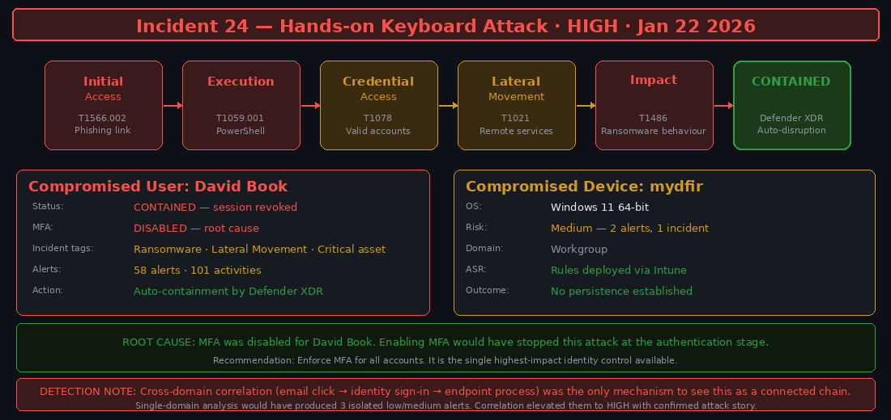
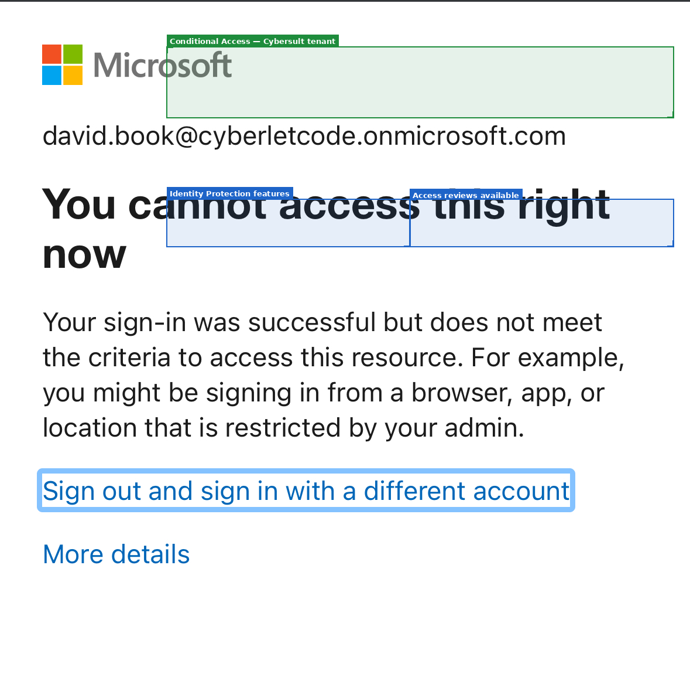
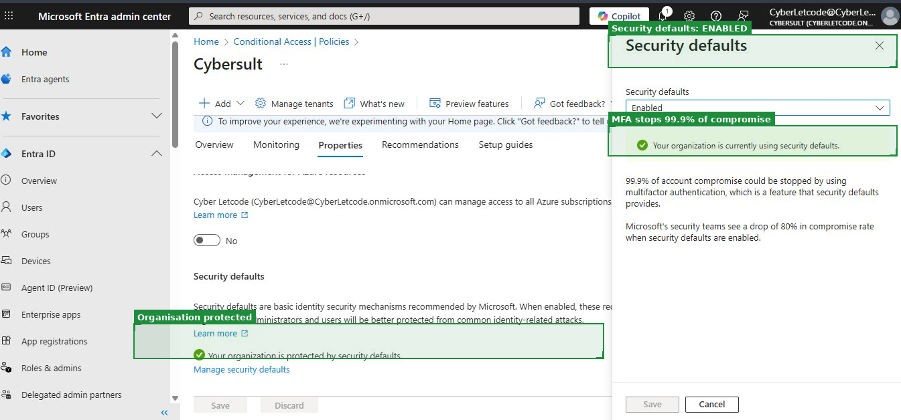
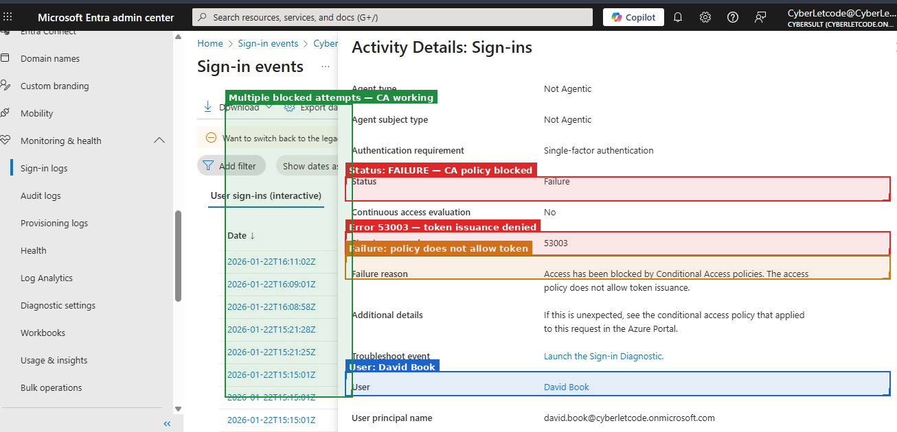
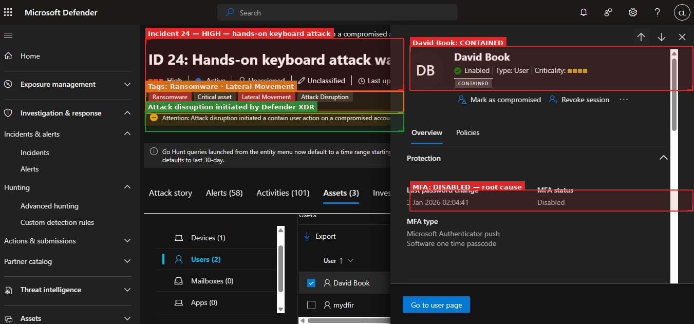

## Mini Project 4 — Cross-Domain Incident Investigation (Capstone)

**Focus:** End-to-End Attack Reconstruction Across Email, Identity, and Endpoint  
**Tools:** Microsoft Sentinel · Defender XDR · Entra ID · KQL  
**Days:** 24–30

---

## Objective

Investigate a simulated multi-stage attack spanning email, identity, and endpoint activity. Correlate telemetry across all three domains, reconstruct the complete attack timeline, and produce a professional incident report.

This is the capstone because it pulls together everything from the previous three phases. The investigation only makes sense if you have visibility into all three domains. The moment you restrict yourself to one, you lose the thread.

---

## The Setup: What Defender XDR Had Already Seen

By Day 24, Defender XDR had been correlating signals from all three prior phases. It had seen the phishing simulation, the authentication anomalies, and the endpoint activity. What it produced was not three separate medium-severity alerts — it was one coherent incident classified as HIGH.



That correlation is the point. Incident 24 — "Hands-on Keyboard Attack" — is a Defender XDR classification that requires evidence of interactive attacker behaviour across multiple stages. No single domain's data would have produced that classification. The email domain saw a suspicious click. The identity domain saw a risky sign-in. The endpoint domain saw suspicious process execution. Together they form a complete attack story.

---

## Identity and Conditional Access

Before getting into the incident itself, Days 24–25 covered the identity and Conditional Access layer.

### Entra ID Configuration




Security defaults were enabled in the Entra ID tenant, which enforces baseline MFA for admin accounts. The Microsoft documentation shown in the screenshot makes the case plainly: 99.9% of account compromise stops with MFA. This is not a contested claim in the security industry.

The reason this is relevant: **David Book's account did not have MFA enabled**.

Security defaults apply MFA to admin accounts and to users when they sign in from unfamiliar locations. The gap is that they are not enforced granularly on every user for every sign-in. That gap is what Conditional Access is designed to close — but only if the policies are configured in block mode rather than report-only mode.

### Conditional Access in Action



The sign-in log entry shows error code 53003 — "Access has been blocked by Conditional Access policies." For David Book, the CA policy eventually blocked further access. But look at what that entry also shows: `Status: Failure`. The authentication itself was **successful**. Valid credentials were used. The CA policy was the last line of defence, and it held — but only after the attack had already progressed significantly.

The sequence that matters:
1. Phishing delivered — email domain
2. User clicks — email domain visibility ends
3. Credentials used to authenticate — identity domain, authentication succeeds
4. CA policy blocks further access — identity domain, too late for some activity
5. Endpoint activity had already occurred — endpoint domain

Without CA policy step, the attacker had full access. With it, they were eventually blocked. Neither outcome is as good as MFA preventing step 3 from succeeding in the first place.

---

## Incident 24 — The Full Investigation



Defender XDR classified this as a hands-on keyboard attack with HIGH severity, tagging it with Ransomware, Critical Asset, and Lateral Movement. 58 alerts. 101 activities. Two assets affected: David Book's user account and the `mydfir` device.

The `CONTAINED` badge on David Book's account shows that Defender XDR triggered automatic attack disruption — sessions were revoked and access was restricted without requiring manual analyst action. That automation worked correctly.

**What the attack story showed:**

The attack chain ran from the initial phishing delivery through to ransomware-classified behaviour in under two hours. The speed is worth noting. Attack timelines in real incidents often compress this way — the window between credential theft and significant impact is measured in minutes to hours, not days.

### Why Cross-Domain Correlation Was the Only Way to See This

The three individual signals that fed Incident 24 were:

1. A low-severity MDO phishing simulation alert
2. A medium-severity Entra ID "sign-in from unfamiliar location" alert
3. No alert from MDE for the PowerShell activity (it looked like admin behaviour)

No single one of those signals would have produced a high-severity incident response. The identity alert is genuinely ambiguous — users travel, work from home, use VPNs. The email alert is low severity by design. The endpoint activity generated no alert at all.

Correlation changed all three. The email click provided the mechanism for the authentication anomaly. The authentication anomaly provided the context for the endpoint activity. Together they produced a confirmed, high-confidence incident with a reconstructed timeline.

This is the pattern I keep returning to. It appears in every significant detection scenario in this lab. And it's the pattern that drives the research question in my PhD proposal: can ML-based approaches learn these cross-domain entity relationships automatically, at a scale that exceeds what explicit correlation rules can encode?

---

## Cross-Domain KQL Used

All three queries below are in the `kql/` directory with full documentation.

```kql
-- Email click → authentication anomaly (phishing confirmation)
-- kql/cross-domain-phishing-to-auth.kql
-- Joins UrlClickEvents to SignInLogs on shared UPN within 30-minute window

-- Password spray → confirmed compromise chain
-- kql/cross-domain-spray-chain.kql
-- Three-stage: spray pattern → success from spray IP → endpoint activity

-- LOLBAS commands with authentication risk context
-- kql/cross-domain-lolbas-context.kql
-- Only surfaces PowerShell commands run by accounts with recent anomalous auth
```

The third query is the one that directly addresses the Incident 24 detection gap. If I had run it during the investigation, it would have surfaced the suspicious PowerShell commands that MDE silently logged — because the authentication context from the identity domain provided the risk elevation that made those commands actionable.

---

## MITRE ATT&CK Mapping

| Stage | Technique | ID |
|---|---|---|
| Initial Access | Spearphishing Link | T1566.002 |
| Credential Access | Credential Harvesting | T1056.003 |
| Valid Account Use | Valid Accounts | T1078 |
| Execution | PowerShell | T1059.001 |
| Persistence (blocked) | Registry Run Keys | T1547.001 |

---

## Full Investigation Report

📄 [Investigation Report](investigation-report.md)

---

## Key Takeaways

**Individual alerts provide limited value without correlation.** This is the core finding of the entire challenge. Every significant threat in this lab was only fully visible when data from two or more domains was combined.

**Identity telemetry is the pivot point.** In every scenario, the identity domain was the link between email and endpoint. The email domain generates the initial signal; the identity domain confirms whether credentials were used; the endpoint domain shows what happened next. The identity layer is the connective tissue.

**Attack timelines compress fast.** Phishing to ransomware-classified behaviour in under two hours in a controlled lab. In production, some stages may take longer — but the assumption that there will be time to investigate before impact is wrong.

**Report-only CA policies are a real operational risk.** Any CA policy in report-only mode is providing visibility, not protection. If you're seeing risky sign-ins in the logs but not blocking them, you're watching attacks succeed in real time.

---

## Improvements Identified

- Automate response using Sentinel playbooks — session revocation and device isolation should not require manual steps
- Enrich investigations with threat intelligence feeds for IP and domain reputation
- Enforce CA policies in block mode before incidents occur, not after
- Build and test cross-domain correlation rules before running simulations, so detection is validated against unknown data

---

## Project Structure

```text
04-cross-domain-investigation/
├── README.md
└── investigation-report.md
```

*Screenshots referenced above are in the root `screenshots/` directory.*  
*KQL queries referenced above are in the root `kql/` directory.*
